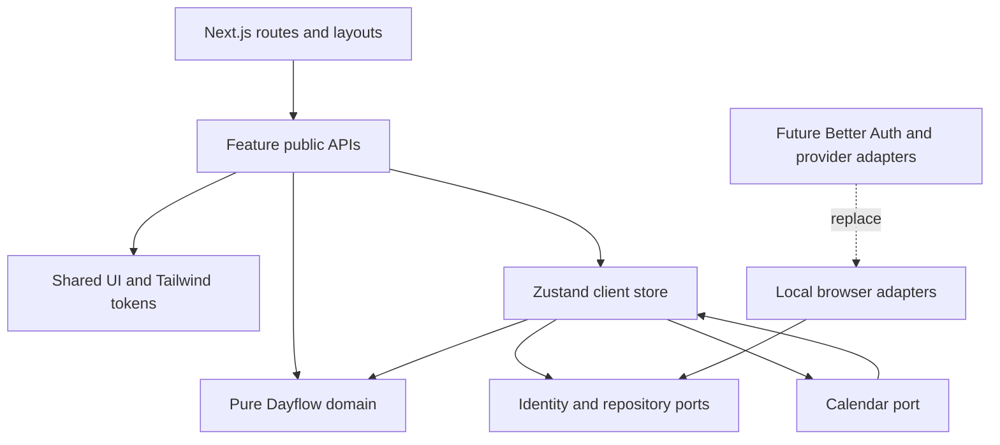
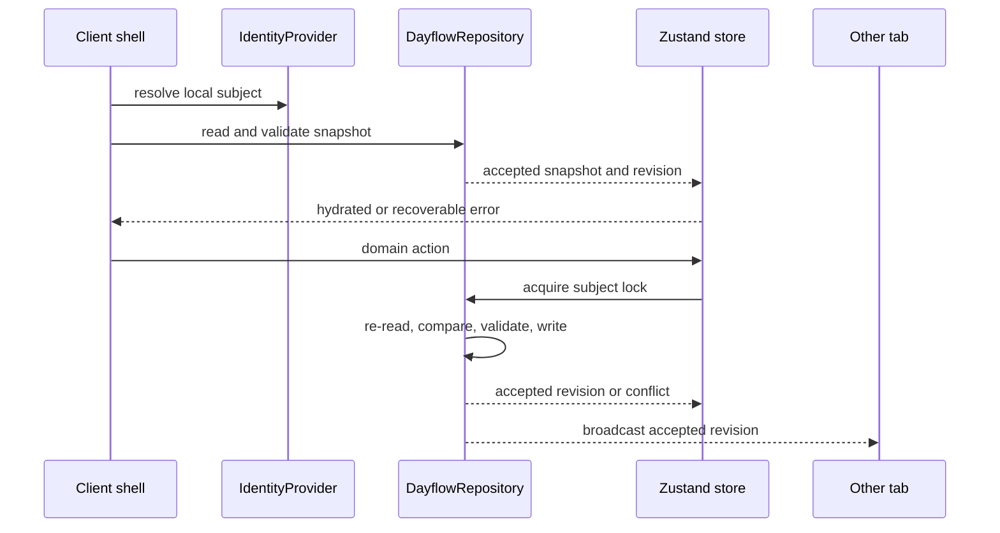
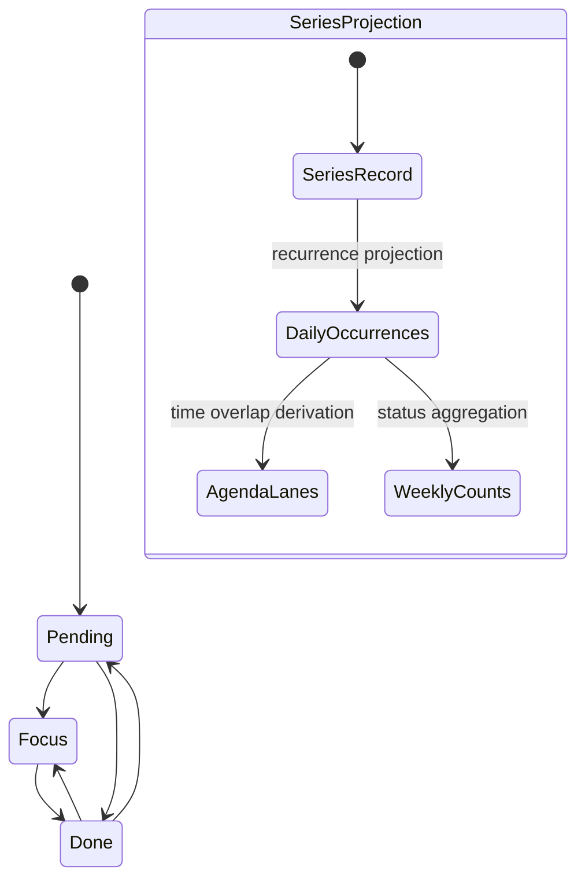

# Dayflow Next.js Migration - Plan

## Goal Capsule

- **Objective:** Replace the static Dayflow prototype with an incremental, production-shaped Next.js application while preserving the validated behavior and rendered Impeccable experience.
- **Product authority:** The confirmed Product Contract in this plan governs behavior; the observable mock governs visual parity when `DESIGN.md` and rendered output disagree.
- **Technical authority:** The Planning Contract governs structure, state ownership, persistence, routing, and test boundaries.
- **Execution profile:** Migrate in dependency order through UI, domain model, persistence, local identity, integration seams, and hardening.
- **Stop conditions:** Stop if implementation requires changing a validated flow, adding server-backed identity, importing ambiguous demo data, or defining provider-specific calendar behavior.
- **Tail ownership:** The migration includes removal of superseded prototype runtime files only after parity gates pass.

---

## Product Contract

### Summary

Dayflow becomes a responsive Next.js application for anonymous, browser-local use.
It preserves the complete observable mock while replacing demo data and monolithic rendering with typed features, real local persistence, and testable boundaries.

### Problem Frame

The current MVP proves the intended interaction and visual direction but runs as one static document with global JavaScript state, seeded data, direct DOM rendering, and a layered stylesheet containing stale and conflicting rules.
It cannot evolve safely without explicit domain boundaries, state ownership, persistence validation, reusable components, and automated parity checks.

### Actors

- A1. **Local user:** Organizes a personal day, changes task state, records energy, and reviews a rolling week in one browser profile.
- A2. **Future identity or calendar adapter:** A deferred system actor that may replace a local port without changing current product behavior.

### Requirements

**Agenda and task behavior**

- R1. The application shall expose `Hoy` and `Semana` as distinct navigable destinations while sharing the validated application shell.
- R2. `Hoy` shall support previous-day, next-day, and return-to-today navigation.
- R3. The daily agenda shall cover 08:00 through 19:00 in 30-minute placement increments.
- R4. A task shall contain an identifier, title, date, optional paired start/end time, status, and recurrence.
- R5. The user shall create, edit, and delete scheduled or unscheduled tasks through the validated drawer flow.
- R6. Scheduled tasks shall remain fully inside agenda bounds; blank start and end create an unscheduled task.
- R7. Overlapping scheduled tasks shall render side by side without persisting presentation-only lane data.
- R8. Recurrence shall support none, daily, weekdays, and weekly.
- R9. A recurring task shall remain one series record; edit, delete, move, and status mutations affect every projected occurrence.
- R10. Dragging shall move a scheduled series in 30-minute increments and re-anchor it to the selected date as the mock does.
- R11. Exact-time editing shall remain available as the non-drag alternative.

**Status, energy, and week**

- R12. Every task shall have exactly one status: `Pendiente`, `En foco`, or `Hecho`.
- R13. Moving a task to `Hecho` shall count as completion, and status or time moves shall support undo.
- R14. The user shall store one daily energy value from 1 through 5 for each local calendar date.
- R15. The weekly view shall show today and the previous six local calendar days.
- R16. Each weekly day shall derive its energy and completed-to-total task count from the current series records.
- R17. Energy shall remain contextual information rather than a mood, diagnosis, or productivity score.

**Identity and persistence**

- R18. First use shall create a stable opaque local identity without requesting a name, email, password, or account.
- R19. Domain data shall persist per local identity across reloads in the same browser.
- R20. The first real application load shall be empty and shall not import or seed `dayflow-mvp-v1` or `dayflow-mvp-v2`.
- R21. Persisted snapshots shall be versioned and runtime-validated before hydration.
- R22. Invalid, unknown, unreadable, or unwritable storage shall produce a recoverable error without silently replacing or discarding the stored snapshot.
- R23. Multiple tabs for the same local identity shall synchronize accepted snapshots and reject or refresh stale writes.
- R24. The application shall not claim authentication, cross-browser continuity, or cross-device synchronization.

**Experience and quality**

- R25. The implementation shall preserve the observable layout, copy, visual hierarchy, responsive behavior, and interaction feedback of the mock.
- R26. The Impeccable tokens and component states shall be represented through Tailwind CSS v4 and reusable React components.
- R27. Loading shall represent actual client hydration or adapter work; artificial prototype delays shall not be retained.
- R28. Agenda, task groups, week, and application data shall each expose appropriate loading, empty, and recoverable error states.
- R29. Keyboard navigation, focus visibility, dialog focus containment and restoration, live announcements, reduced motion, and 44-pixel touch targets shall be preserved.
- R30. Drag-and-drop shall support pointer, touch, and keyboard input without becoming the only way to complete a critical action.

**Extension boundaries**

- R31. Identity and persistence shall be consumed through replaceable ports so a later server-backed identity provider can replace local adapters.
- R32. Calendar access shall use a provider-neutral port with only a local adapter in v1.
- R33. The core task model shall not contain Google, Microsoft, OAuth, sync cursor, webhook, or provider payload concepts.
- R34. Feature modules shall expose public entry points and follow the repository feature protocol.

### Key Flows

- F1. **Anonymous first use**
  - **Trigger:** A1 opens Dayflow without a local identity.
  - **Steps:** Create a local subject, load its empty validated snapshot, and render the real empty `Hoy` state.
  - **Outcome:** The app is usable without identity input or demo records.
  - **Covered by:** R18-R22, R27-R28
- F2. **Plan and update a day**
  - **Trigger:** A1 opens a date and creates or selects a task.
  - **Steps:** Validate the drawer, mutate the series record, persist atomically, derive agenda lanes and state groups, then announce the result.
  - **Outcome:** Every visible projection reflects the accepted snapshot.
  - **Covered by:** R2-R13, R19, R22
- F3. **Record and review energy**
  - **Trigger:** A1 selects an energy value or opens `Semana`.
  - **Steps:** Persist the value for the selected date and derive the rolling seven-day energy and completion summary.
  - **Outcome:** The weekly view shows real local information or its empty state.
  - **Covered by:** R14-R17, R19, R28
- F4. **Reconcile multiple tabs**
  - **Trigger:** Two tabs read the same local identity and one writes a newer snapshot.
  - **Steps:** Broadcast the accepted revision, refresh the other tab, and prevent its stale state from silently overwriting the newer snapshot.
  - **Outcome:** The user receives the latest accepted local data or a recoverable conflict message.
  - **Covered by:** R21-R23

### Acceptance Examples

- AE1. **Empty real first load**
  - **Covers:** R18-R22, R27-R28
  - **Given:** No Dayflow local identity or real snapshot exists, but an old prototype key may exist.
  - **When:** The application hydrates.
  - **Then:** It creates a local identity, ignores old seeded keys, and renders an empty agenda without demo tasks.
- AE2. **Paired time validation**
  - **Covers:** R3-R6
  - **Given:** The task drawer is open.
  - **When:** Only one time is supplied, end is not after start, or the interval exceeds agenda bounds.
  - **Then:** The task is not saved, explicit inline feedback appears, and focus moves to the first invalid field.
- AE3. **Whole-series mutation**
  - **Covers:** R8-R10, R12-R16
  - **Given:** A weekly recurring task appears on several dates.
  - **When:** A projected occurrence is moved to `Hecho`, edited, dragged, or deleted.
  - **Then:** The one series record changes and every occurrence and weekly aggregate recomputes from it.
- AE4. **Corrupt snapshot recovery**
  - **Covers:** R21-R22
  - **Given:** The persisted value is invalid or has an unsupported version.
  - **When:** Hydration runs.
  - **Then:** Dayflow preserves the raw stored value, shows a recoverable error, and offers an explicit reset rather than overwriting it.
- AE5. **Stale-tab protection**
  - **Covers:** R23
  - **Given:** Two tabs loaded revision N.
  - **When:** One tab writes N+1 and the other attempts a mutation from N.
  - **Then:** The stale tab refreshes or rejects its write and never silently replaces N+1.
- AE6. **Accessible movement**
  - **Covers:** R10-R11, R29-R30
  - **Given:** A scheduled task has keyboard focus.
  - **When:** The user moves it with the supported keyboard interaction or edits its exact time without dragging.
  - **Then:** The same series mutation is persisted and announced as with pointer input.

### Success Criteria

- All validated flows pass on desktop and mobile viewports against production builds.
- Selected reference screens remain within reviewed Playwright visual-diff tolerances in a pinned browser environment.
- Automated accessibility checks report no serious or critical violations, and the manual keyboard checklist passes.
- Reload and multi-tab tests demonstrate that accepted user data is not silently replaced.
- A future identity or calendar adapter can be introduced through the defined ports without changing feature component contracts.

### Scope Boundaries

**In scope**

- Full observable functional and visual parity with the current mock.
- Next.js routes, reusable components, feature protocol, typed domain, Zustand state, local persistence, local identity, and adapter seams.
- Characterization, unit, component, end-to-end, accessibility, responsive, and visual tests.

**Deferred to follow-up work**

- Better Auth, a server database, account linking, and cross-device synchronization.
- A concrete Google, Microsoft, Apple, or CalDAV adapter.
- OAuth, webhooks, delta synchronization, conflict resolution, provider-instance exceptions, and provider settings UI.
- Analytics instrumentation and numeric product-validation thresholds.

**Outside this product version**

- Collaboration, AI, notifications, native mobile applications, mood tracking, gamification, and productivity scoring.
- Per-occurrence exceptions for recurring series.
- Importing ambiguous demo-state keys from the static prototype.

### Product Contract Preservation

The Product Contract preserves the confirmed conversation scope and adds implementation-blocking precision for agenda bounds, corrupt storage, multi-tab safety, and whole-series recurrence.
No validated flow was removed.

---

## Planning Contract

### Consolidated Stack

| Concern | Decision | Why |
|---|---|---|
| Runtime | Node.js 24 LTS with the version pinned in repository tooling | Starts on an active LTS line rather than the minimum supported runtime. |
| Framework | Current stable Next.js App Router and React, pinned by the lockfile | Provides explicit routing, layouts, production builds, and a future server boundary without requiring server state in v1. |
| Language | TypeScript in strict mode | Makes domain, port, persisted-envelope, and feature contracts reviewable. |
| Package manager | pnpm with a committed lockfile | Reproducible and lightweight for a single application. |
| Styling | Tailwind CSS v4 with Impeccable tokens in the theme and minimal global CSS | Replaces duplicated raw CSS while keeping visual values explicit and reusable. |
| Client state | Zustand v5 store factory with small selectors and domain actions | Creates one store per resolved local subject without forcing all UI state global or leaking state through the server. |
| Runtime validation | Zod at storage and adapter boundaries | Zustand persistence does not validate parsed browser data. |
| Drag-and-drop | One pinned stable dnd-kit API line | Supplies pointer, touch, keyboard sensors, and accessible announcements while exact editing remains available. |
| Unit/component tests | Vitest, React Testing Library, and user-event | Tests pure rules and user-observable component behavior without coupling to React internals. |
| Browser tests | Playwright with Chromium, WebKit, mobile viewports, and `@axe-core/playwright` | Covers production routing, persistence, input modes, responsive parity, and detectable accessibility failures. |
| Code quality | ESLint, Next.js rules, jsx-a11y coverage, and restricted imports | Enforces the feature protocol and accessibility baseline. |

Better Auth is intentionally absent from v1 dependencies.
Its anonymous plugin requires server-owned user and session persistence, so adding it now would create unused routes and schema rather than a replaceable local identity.

### Key Technical Decisions

- KTD1. **Feature-first modules with enforced public APIs.** Features own UI, hooks, selectors, and tests; cross-feature consumers import through each feature's `index.ts`. `no-restricted-imports` enforces the dependency direction in R34.
- KTD2. **Tailwind owns scalable styling.** Tailwind v4 theme tokens represent the validated palette and spacing, reusable React components own repeated utility combinations, and global CSS is limited to document foundations and exceptional primitives. Governs R25-R26.
- KTD3. **Client island with a per-subject store factory.** Route layouts remain Server Components where useful, while a narrow client provider creates exactly one vanilla Zustand store for the resolved local subject and injects it through React context. The store is never a module singleton or recreated during render. Governs R18-R30.
- KTD4. **State placement follows lifetime and sharing.** Zustand holds identity-scoped domain data and cross-feature actions; search params hold navigable date state; component state holds drawers, drafts, focus, hover, drag, and temporary feedback.
- KTD5. **Versioned repository before store hydration.** A Zod-validated snapshot envelope with revision and schema version sits behind `DayflowRepository`; Zustand consumes the repository rather than treating raw `localStorage` as trusted state. Governs R19-R23.
- KTD6. **Replaceable local identity instead of simulated authentication.** (session-settled: user-directed — chosen over Better Auth backed only by localStorage: real anonymous auth needs server persistence that v1 deliberately defers.) A `LocalIdentityProvider` returns an opaque browser-local subject and can later be replaced by Better Auth. Governs R18, R24, R31.
- KTD7. **Whole-series recurrence is characterized.** (session-settled: user-directed — chosen over per-occurrence exceptions: v1 preserves the validated mock's single-record recurrence.) Domain mutations operate on the series source and projections remain derived. Governs R8-R10, R16.
- KTD8. **Multi-tab writes use serialized optimistic revisions.** (session-settled: user-directed — chosen over single-tab support: local storage is the only data copy and must not be silently overwritten.) A browser-wide per-subject lock serializes re-read, expected-revision validation, and write; when exclusive coordination is unavailable the repository fails safely with a recoverable conflict rather than claiming success. Storage events and BroadcastChannel are notification channels only. Governs R21-R23.
- KTD9. **Calendar is a port, not a second authority.** Core entities stay provider-neutral and v1 ships only a contract/local delegating adapter over the Dayflow application boundary; it owns no storage. Provider authentication, mapping, sync, and exceptions remain deferred. Governs R32-R33.
- KTD10. **Incremental parity precedes cleanup.** The static files remain reference artifacts until functional, accessibility, responsive, and selected visual gates pass; only then are obsolete runtime files removed.
- KTD11. **No global event bus in v1.** UI hooks invoke typed domain commands, commands return typed mutation outcomes, and the repository emits only accepted-revision notifications. Future calendar adapters translate at their port boundary rather than publishing internal application events.
- KTD12. **Browser-local calendar ownership stays client-side.** Server Components render stable route structure but never compute today, rolling-week anchors, or recurrence projections; the hydrated client runtime owns those local-calendar calculations.

### Feature Protocol

The repository shall document and enforce these rules:

1. `src/app/` composes routes and layouts but does not own domain rules.
2. `src/features/<feature>/` owns feature UI, hooks, selectors, local types, and public exports.
3. `src/domain/` owns framework-free entities, value rules, recurrence, date arithmetic, overlap layout inputs, and weekly aggregation.
4. `src/infrastructure/` implements identity, persistence, cross-tab, and calendar ports.
5. `src/shared/` contains design-system primitives and generic utilities with no feature imports.
6. Dependencies point from app to features, features to domain/shared, and infrastructure to declared ports.
7. Feature internals are private; external modules import only from the feature public entry point.
8. Hooks orchestrate React concerns but do not become hidden repositories or duplicate domain rules.
9. Global state is justified by cross-feature sharing or durable lifetime; transient presentation state remains local.
10. Every feature-bearing change includes tests at the lowest useful layer plus E2E coverage when it crosses routes, persistence, or browser input.

### High-Level Technical Design

**Module topology**

**Hydration and mutation lifecycle**

**Task projection and state**

The diagrams define boundaries and lifecycle.
Detailed function signatures remain implementation-owned.

### Route and State Design

- `/` redirects to `/today`.
- `/today` renders the daily destination; `?date=YYYY-MM-DD` represents a non-today selection and supports browser history and deep linking.
- `/week` renders the rolling seven-day destination anchored to the current local day, matching the mock rather than the selected agenda date.
- The shared route-group layout owns desktop navigation, mobile navigation, skip link, metadata, and shell regions.
- Route-derived state is not duplicated into persisted Zustand state.
- Hydration and persistence errors live in the client data boundary; Next.js route-level `loading.tsx` and `error.tsx` cover route failures rather than simulate local storage work.
- Server Components do not infer browser timezone or local day; the client boundary derives today and date projections after hydration.

### Data Design

- **Task:** Persist only `id`, `title`, `date`, `startMinute`, `endMinute`, `status`, and `recurrence`; speculative provider metadata is not stored before a concrete adapter exists.
- **EnergyEntry:** Persist one integer value from 1 through 5 keyed by local calendar date.
- **DayflowSnapshot:** Persist subject, schema version, generation, monotonically increasing revision, task collection, and energy map.
- **LocalIdentity:** Persist an opaque subject and identity-schema version separately from the domain snapshot.
- **Transient state:** Never persist selected tab, selected date, drawer state, draft values, drag state, loading flags, error objects, undo timers, overlap lanes, or computed week results.
- **Date rule:** Store date-only values as canonical `YYYY-MM-DD` strings and perform calendar-day arithmetic without elapsed-millisecond rounding so DST cannot shift recurrence.
- **Series rule:** Do not model occurrence exceptions in v1.
- **Authority invariant:** Exactly one authoritative snapshot exists per subject and generation.
- **Acceptance invariant:** A mutation is accepted only when its expected revision matches the revision re-read inside the serialized write section; one acceptance increments the revision exactly once.
- **Notification invariant:** Duplicate, delayed, malformed, or out-of-order cross-tab messages can trigger a refresh but can never move state to an older revision or arbitrate a write.
- **UI invariant:** Success and undo feedback appear only after durable repository acceptance; rejection leaves the last accepted Zustand state unchanged.
- **Recovery invariant:** Invalid bytes and identity metadata are preserved until an explicit serialized reset succeeds.
- **Reset invariant:** Reset retains the local subject, advances the generation, clears only that subject's snapshot, and prevents a stale tab from resurrecting prior data.
- **Migration invariant:** Migrators are sequential and pure; they validate the target before write, never read prototype keys, never downgrade future versions, and preserve a recovery copy until acceptance.

### Migration Sequence

1. Establish the Next.js and test foundation without deleting the prototype.
2. Recreate the static shell and routes with Tailwind and reference-state screenshots.
3. Extract and test the domain model before connecting mutations.
4. Establish the local identity namespace required by persistence.
5. Add the repository, per-subject Zustand store, hydration, failure handling, and serialized cross-tab protocol.
6. Add the calendar port, then wire all interactive flows.
7. Harden accessibility, responsive behavior, production builds, and visual parity.
8. Remove prototype runtime files only after the cutover gates pass.

### System-Wide Impact

- **Data lifecycle:** Browser storage becomes the sole v1 authority, so validation, atomic acceptance, reset behavior, and cross-tab coherence are correctness boundaries.
- **Privacy:** The local subject is opaque and contains no PII; no identity is sent to a server.
- **Accessibility:** Component decomposition must preserve semantic relationships and focus behavior that direct DOM code currently implements manually.
- **Visual system:** Tailwind tokens and shared variants replace CSS cascade behavior; screenshot parity must catch accidental changes from removed overrides.
- **Future integrations:** Identity and calendar ports create extension seams but ship no dormant provider code.

### Risks and Mitigations

| Risk | Mitigation |
|---|---|
| Tailwind recreation drifts from the rendered mock | Capture a small reviewed baseline before decomposition and compare in a pinned Playwright environment. |
| Prototype CSS contains contradictory values and dead selectors | Treat computed rendered output as authority and migrate component by component rather than copying the stylesheet. |
| Next.js hydration flashes empty data or mismatches HTML | Gate data-bearing client UI on explicit store hydration and keep browser state out of Server Components. |
| Corrupt or quota-limited storage causes data loss | Validate reads, compare revisions, preserve rejected raw data, and require explicit reset. |
| Recurring mutations surprise users or tests | Preserve whole-series semantics with explicit copy and characterization coverage. |
| Revision checks without exclusive coordination allow two N-to-N+1 writes | Serialize each subject's critical section, re-read inside it, and test simultaneous adversarial writes. |
| Corrupt identity metadata or simultaneous first use forks the namespace | Serialize identity creation, preserve invalid metadata, and fail closed instead of minting a replacement subject. |
| A stale tab resurrects data after reset | Advance a reset generation inside the same lock and broadcast the accepted reset. |
| Delayed cross-tab notifications roll state backward | Treat channels as hints and accept only monotonically newer repository revisions. |
| A failed schema migration damages the sole copy | Migrate and validate in memory, retain a recovery copy, and replace only after durable acceptance. |
| Drag-and-drop harms touch scrolling or keyboard use | Configure stable dnd-kit sensors, activation constraints, announcements, and exact-edit fallback. |
| Calendar port overfits a future provider | Keep core contracts series-level and provider-neutral; defer mapping and sync semantics. |
| Feature folders become cosmetic while imports remain tangled | Enforce public entry points and restricted import directions in lint. |

### Sources and Research

- Existing product and visual authority: `PRODUCT.md`, `DESIGN.md`, `index.html`, `app.js`, and `styles.css`.
- [Next.js App Router and installation](https://nextjs.org/docs/app) — App Router structure and supported runtime baseline.
- [Next.js CSS guidance](https://nextjs.org/docs/app/getting-started/css) — Tailwind, global CSS, and production CSS ordering.
- [Zustand persistence](https://zustand.docs.pmnd.rs/reference/middlewares/persist) — versioning, partialization, hydration control, and lack of runtime validation.
- [Next.js with Zustand](https://zustand.docs.pmnd.rs/learn/guides/nextjs) — browser store and Server Component boundaries.
- [Better Auth anonymous plugin](https://better-auth.com/docs/beta/plugins/anonymous) — database-backed anonymous user requirements that justify deferral.
- [dnd-kit accessibility](https://docs.dndkit.com/guides/accessibility) — keyboard, focus, instruction, and announcement obligations.
- [Next.js testing with Vitest](https://nextjs.org/docs/app/guides/testing/vitest) and [Playwright accessibility testing](https://playwright.dev/docs/accessibility-testing) — test-layer boundaries.
- [RFC 5545](https://www.rfc-editor.org/rfc/rfc5545.html) — calendar series and occurrence concepts that the v1 port must not falsely claim to support.

---

## Implementation Units

### U1. Establish the Next.js repository foundation

- **Goal:** Create the reproducible Next.js, TypeScript, Tailwind, lint, and test foundation while retaining the prototype as a parity reference.
- **Requirements:** R25-R26, R34
- **Dependencies:** None
- **Files:**
  - `package.json`
  - `pnpm-lock.yaml`
  - `.nvmrc`
  - `next.config.ts`
  - `tsconfig.json`
  - `postcss.config.mjs`
  - `eslint.config.mjs`
  - `vitest.config.ts`
  - `playwright.config.ts`
  - `src/app/layout.tsx`
  - `src/app/globals.css`
  - `src/app/page.tsx`
  - `src/test/setup.ts`
  - `docs/architecture/feature-protocol.md`
  - `tests/e2e/smoke.spec.ts`
- **Approach:**
  1. Pin Node 24 LTS, stable framework dependencies, pnpm, and the lockfile.
  2. Configure strict TypeScript aliases and lint-enforced dependency directions from KTD1.
  3. Configure Tailwind v4 and translate the executable tokens at the top of `styles.css` without yet rebuilding feature layouts.
  4. Add Vitest, Testing Library, Playwright, and axe foundations.
  5. Document the Feature Protocol and keep `index.html`, `app.js`, and `styles.css` unchanged.
- **Execution note:** This unit is mostly scaffolding; require install, lint, typecheck, production-build, and one route smoke proof before feature work.
- **Patterns to follow:** `DESIGN.md` for intent; rendered prototype and `styles.css` token values for visual authority.
- **Test scenarios:**
  1. Production build renders a Spanish document at the root redirect without runtime errors.
  2. Lint rejects a feature importing another feature's private module.
  3. Playwright can start the production server and reach the Next.js application shell.
- **Verification:** A clean install produces matching dependency versions, all baseline gates execute, and the static prototype remains available for comparison.

### U2. Recreate routes, shell, and visual components

- **Goal:** Rebuild the validated static interface as reusable routed React components with Tailwind before connecting real domain mutations.
- **Requirements:** R1-R3, R25-R30, R34
- **Dependencies:** U1
- **Files:**
  - `src/app/(dayflow)/layout.tsx`
  - `src/app/(dayflow)/today/page.tsx`
  - `src/app/(dayflow)/week/page.tsx`
  - `src/app/(dayflow)/loading.tsx`
  - `src/app/(dayflow)/error.tsx`
  - `src/features/app-shell/index.ts`
  - `src/features/app-shell/components/app-shell.tsx`
  - `src/features/navigation/index.ts`
  - `src/features/navigation/components/day-navigation.tsx`
  - `src/features/agenda/index.ts`
  - `src/features/agenda/components/agenda-timeline.tsx`
  - `src/features/tasks/index.ts`
  - `src/features/tasks/components/task-rail.tsx`
  - `src/features/tasks/components/task-drawer.tsx`
  - `src/features/energy/index.ts`
  - `src/features/energy/components/energy-scale.tsx`
  - `src/features/week/index.ts`
  - `src/features/week/components/week-summary.tsx`
  - `src/shared/ui/index.ts`
  - `src/shared/ui/button.tsx`
  - `src/shared/ui/dialog.tsx`
  - `src/shared/ui/live-region.tsx`
  - `src/features/app-shell/app-shell.test.tsx`
  - `tests/e2e/visual-parity.spec.ts`
- **Approach:**
  1. Map `Hoy` to `/today`, `Semana` to `/week`, and date navigation to the search parameter from the Route and State Design.
  2. Recreate the shell, agenda, task rail, drawer, energy scale, week, empty states, and navigation as semantic components.
  3. Use fixture props only in this phase so visual decomposition is reviewed independently from persistence.
  4. Capture stable reference states at desktop and mobile viewports in the same Playwright environment.
  5. Preserve the current rendered mobile order when prose documentation differs.
- **Execution note:** Land visual slices incrementally and compare after each major region; do not translate the old stylesheet selector by selector.
- **Patterns to follow:** Semantic regions and ARIA relationships in `index.html`; focus, reduced-motion, and responsive behavior in `styles.css`.
- **Test scenarios:**
  1. `/today` and `/week` render their correct navigation state and share the same shell.
  2. Desktop renders agenda and task rail on the validated shared surface.
  3. Mobile renders the validated stacked composition and bottom navigation without horizontal page overflow.
  4. Dialog opens, traps focus, closes by Escape/backdrop/button, and restores focus.
  5. Energy options expose one radiogroup with correct accessible names and roving keyboard focus.
  6. Reviewed visual fixtures match the mock for default, focus, empty, drawer, overlap, and week states.
- **Verification:** Reviewers can compare the fixture-backed Next.js screens with the mock and find no unexplained layout, typography, color, responsive, or focus-state drift.

### U3. Extract the typed Dayflow domain

- **Goal:** Reimplement prototype algorithms as pure typed domain modules without React, browser storage, or provider dependencies.
- **Requirements:** R3-R17, R33
- **Dependencies:** U1
- **Files:**
  - `src/domain/dayflow/task.ts`
  - `src/domain/dayflow/energy.ts`
  - `src/domain/dayflow/calendar-date.ts`
  - `src/domain/dayflow/recurrence.ts`
  - `src/domain/dayflow/agenda.ts`
  - `src/domain/dayflow/week-summary.ts`
  - `src/domain/dayflow/commands.ts`
  - `src/domain/dayflow/index.ts`
  - `src/domain/dayflow/task.test.ts`
  - `src/domain/dayflow/recurrence.test.ts`
  - `src/domain/dayflow/agenda.test.ts`
  - `src/domain/dayflow/week-summary.test.ts`
- **Approach:**
  1. Define canonical entities and mutation results with no React or Zustand types.
  2. Replace elapsed-millisecond recurrence with local calendar-date arithmetic.
  3. Keep recurrence projections pure and whole-series mutations explicit under KTD7.
  4. Compute overlap lanes and weekly summaries as view models without mutating task records.
  5. Encode agenda-bound and paired-time validation once for both forms and commands.
- **Execution note:** Add characterization tests from `app.js` before replacing each algorithm, then add boundary cases that the prototype did not safely handle.
- **Patterns to follow:** `app.js` occurrence, lane, drag-clamp, and week aggregation behavior; Product Contract R3-R17 overrides prototype defects.
- **Test scenarios:**
  1. None, daily, weekdays, and weekly recurrences project on correct local dates across weekends and DST boundaries.
  2. Whole-series status, edit, drag re-anchor, and delete operations change every projected occurrence.
  3. Unscheduled tasks accept both blank times and reject a single blank time.
  4. Scheduled tasks reject end-before-start and values outside 08:00-19:00.
  5. Overlap lanes are deterministic and never appear on persisted task objects.
  6. The rolling week is today plus six prior local dates and derives done/total from current series status.
  7. Energy accepts only integer values 1 through 5.
- **Verification:** Pure tests reproduce validated prototype behavior, cover known boundaries, and import no React, Next.js, Zustand, storage, or provider modules.

### U4. Add validated Zustand persistence and tab coherence

- **Goal:** Make the typed domain durable through a Zustand store backed by a validated, versioned, revision-aware local repository.
- **Requirements:** R19-R23, R27-R28
- **Dependencies:** U3, U8
- **Files:**
  - `src/ports/dayflow-repository.ts`
  - `src/infrastructure/persistence/dayflow-snapshot-schema.ts`
  - `src/infrastructure/persistence/local-dayflow-repository.ts`
  - `src/infrastructure/persistence/browser-subject-lock.ts`
  - `src/infrastructure/persistence/cross-tab-channel.ts`
  - `src/store/create-dayflow-store.ts`
  - `src/store/dayflow-store.ts`
  - `src/store/dayflow-selectors.ts`
  - `src/store/dayflow-provider.tsx`
  - `src/store/use-dayflow-hydration.ts`
  - `src/infrastructure/persistence/local-dayflow-repository.test.ts`
  - `src/store/dayflow-store.test.ts`
  - `tests/e2e/persistence.spec.ts`
- **Approach:**
  1. Define the versioned snapshot and runtime schema from the Data Design.
  2. Namespace snapshots by the subject resolved in U8 and reject subject-envelope mismatches.
  3. Create one store instance per subject and hydrate it explicitly through React context.
  4. Persist only whitelisted durable fields through the repository; Zustand middleware must not auto-write around repository acceptance.
  5. Serialize re-read, expected-revision validation, migration or mutation, and write under the per-subject lock from KTD8.
  6. Broadcast accepted revisions only after durable write and ignore non-monotonic notifications.
  7. Preserve invalid raw values until an explicit serialized reset retains the subject and advances generation.
  8. Keep the previous accepted in-memory snapshot when quota, lock, validation, or write errors occur.
- **Execution note:** Implement repository failure tests before connecting UI actions because browser storage is the sole v1 authority.
- **Patterns to follow:** Zustand v5 `persist` lifecycle concepts, but keep runtime validation and compare-and-write behavior inside the repository port.
- **Test scenarios:**
  1. A valid current snapshot hydrates once without an empty-state flash.
  2. Missing storage produces an empty snapshot and never reads prototype keys.
  3. Older supported versions migrate deterministically.
  4. Unknown or corrupt snapshots surface recovery and remain unmodified until explicit reset.
  5. A quota failure does not commit a UI-visible domain mutation as durable success.
  6. Two tabs attempting N-to-N+1 simultaneously produce exactly one acceptance; the loser refreshes or reports conflict.
  7. Delayed, duplicate, malformed, and out-of-order notifications never roll visible state backward.
  8. A reset racing a stale mutation cannot resurrect the previous generation.
  9. A migration write failure preserves the prior accepted raw snapshot and an unknown future version is never downgraded.
  10. Persisted content excludes route, drawer, drag, error, loading, undo, lane, and derived-week state.
- **Verification:** Reload, corruption, quota, migration, and cross-tab tests prove the repository contract and the store exposes explicit idle, hydrating, ready, error, and conflict states.

### U8. Establish the local identity namespace

- **Goal:** Resolve one stable opaque browser-local subject before repository hydration without presenting it as authentication.
- **Requirements:** R18, R24, R31
- **Dependencies:** U3
- **Files:**
  - `src/ports/identity-provider.ts`
  - `src/infrastructure/identity/local-identity-schema.ts`
  - `src/infrastructure/identity/local-identity-provider.ts`
  - `src/infrastructure/identity/local-identity-provider.test.ts`
  - `tests/e2e/anonymous-session.spec.ts`
- **Approach:**
  1. Serialize first-use identity creation across tabs so simultaneous opens converge on one subject.
  2. Store identity metadata separately from Dayflow snapshots and expose it only through the port.
  3. Preserve corrupt or unsupported identity bytes and block hydration with recovery rather than minting a new subject.
  4. Treat storage denial as identity-boundary failure instead of an ephemeral successful session.
  5. Retain the subject during domain reset so snapshot namespaces are not orphaned.
- **Execution note:** Prove first-use races and corrupt-identity recovery before repository namespacing consumes the port.
- **Patterns to follow:** KTD6 and the Data Design identity and recovery invariants.
- **Test scenarios:**
  1. First load creates one opaque subject without PII and reload resolves the same subject.
  2. Two fresh tabs opening simultaneously converge on exactly one subject.
  3. Corrupt or unsupported identity metadata is preserved and prevents domain hydration.
  4. Disabled or quota-limited storage does not report a successful anonymous session.
  5. Domain reset retains the subject and does not expose another subject's namespace.
- **Verification:** Identity resolves before U4 hydration, never falls back to an empty default subject, and cannot silently fork or orphan valid data.

### U5. Introduce the calendar port

- **Goal:** Supply a provider-neutral calendar seam without installing or simulating a calendar provider.
- **Requirements:** R32-R33
- **Dependencies:** U4
- **Files:**
  - `src/ports/calendar-adapter.ts`
  - `src/infrastructure/calendar/local-calendar-adapter.ts`
  - `src/infrastructure/adapters.ts`
  - `src/infrastructure/calendar/local-calendar-adapter.test.ts`
- **Approach:**
  1. Define provider-neutral calendar capabilities around Dayflow series and local date/time values.
  2. Implement only a local adapter that delegates to the Dayflow application boundary and owns no data.
  3. Document unsupported provider operations in the port.
  4. Compose the adapter at the client boundary rather than importing it inside features.
- **Patterns to follow:** KTD9 and KTD11; RFC 5545 only as a vocabulary boundary, not as a promise of full recurrence support.
- **Test scenarios:**
  1. Local calendar adapter delegates canonical series operations without creating a second store.
  2. Task records remain free of speculative provider metadata.
  3. No Better Auth or external calendar package appears in the runtime dependency graph.
- **Verification:** Features depend only on the calendar port and adapter replacement does not require changing domain or feature APIs.

### U6. Connect all interactive feature flows

- **Goal:** Replace fixtures with selectors, hooks, and domain actions while preserving every validated interaction.
- **Requirements:** R1-R30
- **Dependencies:** U2, U3, U4, U5, U8
- **Files:**
  - `src/features/today/index.ts`
  - `src/features/today/components/today-screen.tsx`
  - `src/features/today/hooks/use-selected-date.ts`
  - `src/features/tasks/hooks/use-task-actions.ts`
  - `src/features/tasks/hooks/use-task-draft.ts`
  - `src/features/tasks/components/task-status-control.tsx`
  - `src/features/agenda/hooks/use-agenda-drag.ts`
  - `src/features/agenda/components/agenda-event.tsx`
  - `src/features/energy/hooks/use-energy.ts`
  - `src/features/week/hooks/use-week-summary.ts`
  - `src/shared/ui/toast-region.tsx`
  - `src/features/tasks/task-flow.test.tsx`
  - `src/features/agenda/agenda-interactions.test.tsx`
  - `src/features/energy/energy-scale.test.tsx`
  - `tests/e2e/critical-flows.spec.ts`
- **Approach:**
  1. Connect feature hooks to narrow Zustand selectors and domain commands.
  2. Keep form drafts, dialog state, focus, and drag state local under KTD4.
  3. Use one shared energy component in desktop and mobile placements.
  4. Configure dnd-kit pointer, touch, and keyboard sensors for the 30-minute agenda grid with localized announcements.
  5. Route all mutation outcomes through accessible success, undo, conflict, and error feedback.
  6. Preserve whole-series effects in visible copy and action naming.
- **Execution note:** Connect one vertical flow at a time and retain fixture rendering until that flow passes its component and browser scenarios.
- **Patterns to follow:** Existing entry points and copy in `index.html`; existing focus and announcement behavior in `app.js`.
- **Test scenarios:**
  1. Create scheduled and unscheduled tasks from global, mobile, empty, and slot entry points.
  2. Edit and delete a task from agenda and task rail, including whole-series consequences.
  3. Move tasks among all statuses and undo the change.
  4. Drag a scheduled task by pointer, touch, and keyboard; cancel by Escape; use exact-time edit as fallback.
  5. Navigate dates through buttons and browser history without duplicating route state in the store.
  6. Record and overwrite energy using click and arrow-key interaction.
  7. Render week empty, partial-energy, and full-summary states from real store data.
  8. Surface missing-record, validation, persistence, and stale-tab failures without false success feedback.
- **Verification:** Critical user flows pass against a production build on desktop and mobile projects, and every critical drag action has a tested non-drag equivalent.

### U7. Harden parity, accessibility, and cutover

- **Goal:** Prove the migrated application meets the contract, remove prototype runtime dependencies, and leave a portable reviewable repository.
- **Requirements:** R1-R34
- **Dependencies:** U6
- **Files:**
  - `tests/e2e/accessibility.spec.ts`
  - `tests/e2e/responsive.spec.ts`
  - `tests/e2e/recurrence.spec.ts`
  - `tests/e2e/multi-tab.spec.ts`
  - `tests/e2e/visual-parity.spec.ts`
  - `tests/e2e/fixtures/`
  - `README.md`
  - `docs/architecture/feature-protocol.md`
  - `index.html`
  - `app.js`
  - `styles.css`
- **Approach:**
  1. Run the full verification matrix in the pinned production environment.
  2. Review visual diffs rather than automatically accepting new baselines.
  3. Complete a manual keyboard and responsive checklist alongside axe.
  4. Verify dependency boundaries and document state-ownership examples.
  5. Remove or archive the prototype runtime files only after every cutover gate passes.
  6. Confirm no abandoned CSS translations, duplicate stores, dormant auth code, provider SDKs, or dead feature experiments remain.
- **Execution note:** Treat prototype deletion as the last reversible cutover action after parity evidence is accepted.
- **Patterns to follow:** Product Contract success criteria and KTD10.
- **Test scenarios:**
  1. All F1-F4 and AE1-AE6 pass on the production build.
  2. Chromium desktop and representative mobile projects pass critical flows.
  3. WebKit passes navigation, persistence, forms, and keyboard alternatives.
  4. Axe reports no serious or critical violations on `Hoy`, `Semana`, drawer, empty, loading, and error states.
  5. Manual keyboard traversal preserves skip link, focus order, visible focus, dialog containment, restoration, and reduced motion.
  6. Visual baselines show no unexplained drift in selected stable states.
  7. Clean install, lint, typecheck, unit/component tests, E2E, and production build all pass after prototype removal.
- **Verification:** The Next.js application is the sole runtime, the repository documents its feature protocol, and every Definition of Done item has evidence.

---

## Verification Contract

| Gate | Scope | Required outcome |
|---|---|---|
| Install reproducibility | U1-U8 | Frozen pnpm install succeeds from the committed lockfile on Node 24 LTS. |
| Lint and boundaries | U1-U8 | ESLint passes and rejects private cross-feature imports, unsafe accessibility patterns, and disallowed dependency directions. |
| Type safety | U1-U8 | Strict TypeScript checking passes without suppressing domain, port, or persisted-schema errors. |
| Unit and component tests | U2-U6, U8 | Vitest passes domain, schema, identity, repository, store, hook, and component interaction scenarios. |
| Production build | U1-U8 | Next.js production build completes without hydration, route, or CSS-order warnings. |
| Browser flows | U2, U4-U7 | Playwright passes critical flows against the production server on required desktop and mobile/browser projects. |
| Persistence safety | U4-U8 | Reload, corrupt snapshot, denied/quota storage, failed migration, first-use identity race, simultaneous writes, reset-vs-stale mutation, and out-of-order notification scenarios pass without overwrite, resurrection, identity fork, revision rollback, or premature UI success. |
| Accessibility | U2, U6-U7 | Axe has no serious or critical findings and the manual keyboard checklist passes. |
| Visual parity | U2, U7 | Reviewed stable-state screenshots show no unexplained regression in the pinned environment. |
| Dependency audit | U5-U7 | No Better Auth, database, provider SDK, or OAuth dependency ships in v1. |

---

## Definition of Done

- R1-R34 are implemented without changing the confirmed Product Contract.
- U1-U8 satisfy their verification outcomes and test scenarios.
- `/today` and `/week` own navigation, and browser history behaves predictably.
- The rendered desktop and mobile experience preserves the accepted Impeccable design.
- Domain algorithms are pure, typed, and covered at recurrence, calendar, overlap, and weekly boundaries.
- One subject-scoped Zustand store contains only justified cross-feature or durable state and exposes narrow selectors.
- Local persistence is versioned, validated, identity-scoped, recoverable, and coherent across tabs.
- No UI success or undo state appears before durable mutation acceptance.
- Better Auth and provider integrations remain replaceable follow-up adapters rather than dormant v1 code.
- Feature boundaries, public APIs, hook responsibilities, and state ownership are documented and lint-enforced.
- Loading, empty, error, conflict, undo, and success states are accessible and tested.
- Critical flows pass through pointer, keyboard, and mobile-compatible interaction paths.
- The static prototype is no longer a runtime dependency after approved cutover.
- Abandoned approaches, dead CSS translations, unused dependencies, duplicate state, and experimental code are removed from the final diff.
