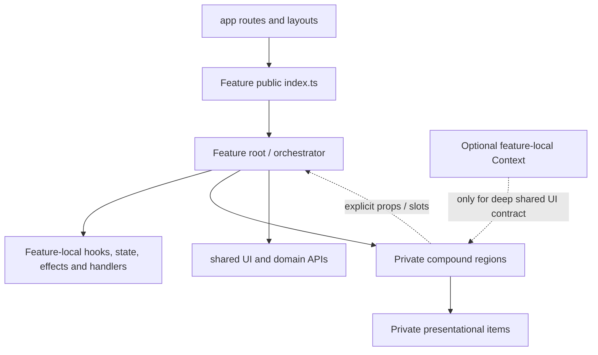

# refactor: Organize features with private compound components

## Goal Capsule

- **Objective:** Replace large inline JSX returns with feature-local compound component trees that make each UI feature easier to read, change, and extend while preserving the current product behavior and visual output.
- **Authority:** `docs/architecture/feature-protocol.md` governs feature boundaries, private internals, public `index.ts` entry points, and local ownership of ephemeral UI state.
- **Execution profile:** Incremental, characterization-first refactor. Preserve DOM semantics, accessibility names, focus behavior, state lifetimes, keys, and client/server boundaries unless a unit explicitly calls for a correction.
- **Stop conditions:** Do not introduce a global component framework, publish internal subcomponents, move transient UI state to Zustand, or make product/design changes as part of this work.

---

## Product Contract

### Problem Frame

Several feature entry components currently combine orchestration, hooks, handlers, conditional states, and their entire presentation tree in a single inline return. The result is difficult to scan and makes future feature growth prone to accidental coupling.

### Requirements

- R1. Every affected feature presents its UI through small, named, private compound components organized under that feature.
- R2. Each feature retains its existing public surface through `src/features/<feature>/index.ts`; consumers must not import feature internals and new presentation regions remain private.
- R3. State, effects, persistence calls, and interaction handlers remain in the nearest feature-local orchestrator that owns the behavior.
- R4. The refactor preserves visible UI, routing, persistence behavior, keyboard interaction, focus management, accessible roles/names, feedback messages, and responsive variants.
- R5. The migration is incremental and verified by behavior, so a feature can be safely completed before the next one changes.
- R6. Context is deferred for this migration; use explicit props and composition for the current shallow relationships, reserving a feature-local Context for a proven future deep-sharing need.

### Scope Boundaries

- In scope: the existing UI features under `src/features/`, with priority based on composition complexity and interaction risk.
- In scope: feature-local presentation components, local prop contracts, tests that characterize preserved behavior, and a documented convention for future features.
- Out of scope: new product capabilities, visual redesign, domain-rule changes, store redesign, a shared/global compound-component library, or changing public feature APIs without a separately justified need.

---

## Planning Contract

### Key Technical Decisions

- KTD1. **Use private feature compound components, not a public React compound API.** Each complex feature keeps its existing exported root or hook and composes named internal regions such as `Header`, `Content`, `Actions`, `Item`, or `Step`. Internal pieces receive narrow, explicit props or slots and are never added to the feature barrel. This preserves existing contracts such as the cross-feature `useTaskActions` export while keeping presentation private.
- KTD2. **Keep behavior ownership at the feature root.** Hooks, effects, state transitions, persistence calls, DnD sensors and announcements, and cross-region callbacks stay in the feature-local root/controller. Regions may own only interaction state that is strictly local and unobservable outside their boundary. This prevents duplicate drawers, disconnected feedback, and onboarding state resets.
- KTD3. **Do not add Context in this migration.** The current component relationships are shallow enough for explicit props and slots. If a later feature has several deep, non-contiguous consumers of the same UI contract, it may introduce a private Context with a stable, narrowly scoped value; it must not be exposed through `index.ts`.
- KTD4. **Preserve existing client boundaries.** Do not elevate `'use client'` to routes or layouts. New interactive files stay under their existing client component graph, and no server-only dependency crosses into it.
- KTD5. **Characterize behavior before structural extraction.** Tests assert user-observable contracts through roles, labels, focus, navigation, and persisted outcomes rather than the new component tree's implementation details.
- KTD6. **Migrate standalone feature roots before the shell integrator.** Stabilize task, agenda, onboarding, and focused feature contracts before decomposing `AppShell`, which composes those contracts without changing them.

### High-Level Technical Design

The root remains the feature's behavior boundary. Compound regions clarify presentation and composition; they do not become cross-feature APIs or a second global state layer.

### Component Convention

- Keep the current exported component name and its public props unless a unit explicitly identifies a compatibility-safe improvement.
- Group each complex root under `src/features/<feature>/components/<root-name>/`, with its semantic regions together. Regions may import domain types and receive root-owned props, but never import their own barrel/root or another feature's internals; this prevents cycles and leaky APIs.
- Extract at semantic boundaries: shell/sidebar/header/main/actions, dialog header/form sections, timeline slot/event, list group/row, onboarding step, navigation item, energy option, or week day card.
- Define subcomponents at module scope. Preserve list keys, conditional placement, and element types so React does not reset local state unexpectedly.
- Prefer explicit props and `children` slots. Avoid `Children.map`, `cloneElement`, broad prop spreading, and Context in this migration.
- Keep shared primitives (`Button`, `Dialog`, `LiveRegion`) as the existing reusable layer; feature components do not duplicate those primitives.

### Assumptions

- The goal is an internal architecture convention for the current feature set, not a reusable package for arbitrary applications.
- Existing `index.ts` barrels are the intended public API surface and should remain stable.
- The current committed and uncommitted UI behavior is the baseline to preserve; this refactor must not discard unrelated local work.

---

## Implementation Units

### U1. Establish the private feature-composition convention and characterization baseline

- **Goal:** Define the directory/API convention and lock down the high-risk user contracts before moving JSX.
- **Requirements:** R1, R2, R4, R5, R6.
- **Dependencies:** None.
- **Files:** `docs/architecture/feature-protocol.md`, `eslint.config.mjs`, `src/features/app-shell/app-shell.test.tsx`, `tests/e2e/visual-parity.spec.ts`, `tests/e2e/onboarding.spec.ts`, plus focused feature test files or static-boundary checks created only where existing coverage is insufficient.
- **Approach:**
  1. Extend the feature protocol with the private compound-component convention, root-directory layout, export rule, state-ownership rule, deferred-Context rule, and client-boundary rule.
  2. Establish the common refactor test posture: feature roots receive integration-level behavior tests; extracted leaves get focused tests only when they own meaningful variants, events, or accessibility semantics.
  3. Add missing characterization coverage before extraction for drawer failure retention, invalid/cancelled agenda drops, energy persistence/roving focus, and onboarding save failure.
  4. Strengthen the feature-boundary check to reject both alias and relative imports that cross into another feature's internals, and verify that barrels do not re-export `components/**` regions.
- **Patterns to follow:** `docs/architecture/feature-protocol.md`; `src/shared/ui/dialog.tsx`; `src/features/app-shell/app-shell.test.tsx`; `tests/e2e/visual-parity.spec.ts`.
- **Test scenarios:**
  - Opening a new task from desktop and mobile keeps a single dialog, focuses the title input, traps focus, and restores the originating trigger on close.
  - A failed task create or edit leaves the drawer, draft, and error message available for correction.
  - Dropping an agenda task outside a valid slot or cancelling a drag does not persist a move; valid drops retain accessible announcements.
  - Selecting energy persists the selected radio for the active date and arrow keys move roving focus without changing accessible names.
  - A failed onboarding routine creation retains the active step and alert; only a successful sequence marks the profile complete.
  - Existing barrel symbols remain available, while imports across features resolve only through the target feature's barrel.
- **Verification:** The protocol explains the convention without changing public feature imports, and tests capture the existing high-risk behavior before any feature extraction.

### U2. Decompose the application shell into private layout regions

- **Goal:** Make `AppShell` readable as the owner of page state and composition while separating sidebar, header, today content, mobile controls, and failure presentation.
- **Requirements:** R1, R2, R3, R4, R5.
- **Dependencies:** U1, U3, U4, U5.
- **Files:** `src/features/app-shell/components/app-shell.tsx`, new private modules under `src/features/app-shell/components/`, `src/features/app-shell/index.ts`, `src/features/app-shell/app-shell.test.tsx`, `tests/e2e/visual-parity.spec.ts`.
- **Approach:**
  1. Retain `AppShell` as the sole owner of drawer state, edited task, focus restoration, feedback timer, selected-date actions, hydration failure handling, and cross-feature callbacks.
  2. Extract semantic shell regions with explicit props: synchronization error, desktop sidebar, page header/date controls, today layout, mobile task action, and shell navigation/live feedback placement.
  3. Keep feature dependencies imported through their public barrels, and keep only `AppShell` and `DayflowClientProvider` publicly exported.
- **Patterns to follow:** `src/features/app-shell/components/dayflow-client-provider.tsx`; `src/features/today/hooks/use-selected-date.ts`; `src/shared/ui/live-region.tsx`.
- **Test scenarios:**
  - Today renders the selected date's title, kicker, agenda, task rail, desktop sidebar, and mobile variants without duplicating controls or navigation.
  - Week renders the same shell with week content and the return-to-today route while omitting Today-only task controls.
  - New-task and edit-task triggers open the same drawer contract, retain error behavior, and route success/failure feedback through one live region.
  - Hydration error and conflict show the existing recovery alert and retry action.
- **Verification:** `AppShell` reads as state/orchestration plus named regions; existing barrel imports and all shell accessibility/focus E2E checks remain valid.

### U3. Refactor task and agenda interaction trees without changing their contracts

- **Goal:** Split the task drawer, task rail, and agenda timeline into feature-local regions while preserving their shared editing, feedback, and drag-and-drop behavior.
- **Requirements:** R1, R2, R3, R4, R5.
- **Dependencies:** U1.
- **Files:** `src/features/tasks/components/task-drawer.tsx`, `src/features/tasks/components/task-rail.tsx`, new private modules under `src/features/tasks/components/task-drawer/` and `src/features/tasks/components/task-rail/`, `src/features/tasks/index.ts`, focused task feature tests, `src/features/agenda/components/agenda-timeline.tsx`, new private modules under `src/features/agenda/components/agenda-timeline/`, `src/features/agenda/index.ts`, focused agenda feature tests, `tests/e2e/visual-parity.spec.ts`.
- **Approach:**
  1. Keep `TaskDrawer` as the owner of draft lifecycle, submit behavior, reset/close behavior, and feedback; extract dialog header, field groups, error state, and submit actions as private components with explicit draft/callback contracts.
  2. Keep `TaskRail` as the owner of occurrence selection and status mutation; extract status groups and task rows while retaining the edit trigger and status-select semantics.
  3. Keep `AgendaTimeline` as the DnD owner; extract timeline header, droppable slot, draggable event, and event-list region while preserving sensor setup, announcements, lane calculations, and callbacks.
  4. Preserve all current public feature exports, including `useTaskActions` from tasks; `AgendaTimeline` and onboarding continue to consume task actions only via `@/features/tasks`.
- **Patterns to follow:** `src/features/tasks/hooks/use-task-draft.ts`; `src/features/tasks/hooks/use-task-actions.ts`; current private `Slot` and `AgendaEvent` precedent in `src/features/agenda/components/agenda-timeline.tsx`; `src/shared/ui/dialog.tsx`.
- **Test scenarios:**
  - New and edit task forms initialize the right draft, preserve values on persistence failure, announce success, reset on close, and restore the trigger focus.
  - The rail renders pending, focus, and done groups with correct counts; editing a row and changing its status remain independently usable and announce the result.
  - The agenda renders recurring occurrences in deterministic lanes with the current time gutter, minimum height, title, and time visibility for short events.
  - Pointer, touch, and keyboard drag operations keep valid move behavior and accessible start/over/end/cancel announcements; an invalid drop performs no mutation.
  - The shell still receives one `onEdit` and feedback path from both agenda and rail after extraction.
  - Existing consumers can import current root components and `useTaskActions` from their barrels while no private region is exported.
- **Verification:** Feature roots contain behavior and named composition, no nested feature imports or cycles are introduced, and task/agenda behavior passes component and browser coverage.

### U4. Split onboarding into a stable root and private step components

- **Goal:** Make the three-step onboarding flow maintainable without changing its blocking, persistence, or task-creation semantics.
- **Requirements:** R1, R2, R3, R4, R5.
- **Dependencies:** U1.
- **Files:** `src/features/onboarding/components/onboarding-flow.tsx`, new private modules under `src/features/onboarding/components/onboarding-flow/`, `src/features/onboarding/index.ts`, focused onboarding feature tests, `tests/e2e/onboarding.spec.ts`.
- **Approach:**
  1. Retain `OnboardingFlow` as the owner of hydration/profile visibility, local storage reads/writes, all step state, routine collection, save sequencing, and error state.
  2. Extract the branded overlay frame, progress indicator, shared step copy, and step-specific name/routine/start-date forms into private components with narrow data/action props.
  3. Preserve the create-routines-before-profile-completion order and avoid remounting the active form through changed keys or conditional tree placement.
- **Patterns to follow:** `src/features/onboarding/components/onboarding-flow.tsx`; `src/features/tasks/hooks/use-task-actions.ts`; `src/shared/ui/button.tsx`.
- **Test scenarios:**
  - Hydrated subjects with a stored profile do not see onboarding; an unprofiled subject sees the blocking dialog after hydration.
  - Step one supports continue and skip, step two supports adding routines/back/continuing without routines, and step three preserves the chosen start date.
  - Successful routine creation creates each configured routine before persisting completion and prevents the flow from returning on reload.
  - A routine-creation failure keeps the user on the active step with inputs intact and an accessible error, without persisting completion.
- **Verification:** The exported `OnboardingFlow` keeps the same host integration while the root's state transitions are separate from its layout and forms.

### U5. Apply the convention to focused UI features and close the migration

- **Goal:** Bring the smaller feature trees into the same readable composition pattern and audit the completed feature surface for boundary regressions.
- **Requirements:** R1, R2, R4, R5, R6.
- **Dependencies:** U1.
- **Files:** `src/features/energy/components/energy-scale.tsx`, new private modules under `src/features/energy/components/energy-scale/`, `src/features/navigation/components/day-navigation.tsx`, new private modules under `src/features/navigation/components/day-navigation/`, `src/features/week/components/week-summary.tsx`, new private modules under `src/features/week/components/week-summary/`, `src/features/energy/index.ts`, `src/features/navigation/index.ts`, `src/features/week/index.ts`, focused feature tests where characterization is missing, `tests/e2e/visual-parity.spec.ts`.
- **Approach:**
  1. Keep each current exported root as the public entry point and extract only semantic repeated/presentational units: energy option, navigation item, and weekly day card/header regions.
  2. Preserve separate desktop and mobile energy instances and their unique IDs; do not share transient state between them.
  3. Audit every changed feature for private-only subcomponent exports, preserved client boundaries, explicit props, stable list keys, absence of nested feature imports, and import cycles.
- **Patterns to follow:** `src/features/energy/components/energy-scale.tsx`; `src/features/navigation/components/day-navigation.tsx`; `src/features/week/components/week-summary.tsx`; `docs/architecture/feature-protocol.md`.
- **Test scenarios:**
  - Each energy scale retains five uniquely named radios, selected-or-first tab stop, arrow-key roving focus, persistence for its date, and success/failure feedback.
  - Desktop and mobile navigation render their existing labels and active route state without duplicate IDs or changed route targets.
  - Week retains seven-day rendering, current-day treatment, energy marker, completed/total values, and the no-energy state.
  - A static import audit confirms app/feature consumers use public feature barrels and no new internal component appears in another feature's imports.
- **Verification:** All current feature roots follow one documented private composition convention while their public imports and observable UI behavior remain unchanged.

---

## Verification Contract

| Gate | Applies to | Done signal |
| --- | --- | --- |
| `pnpm lint` | Every unit | No lint, import-cycle, or feature-boundary violations. |
| `pnpm typecheck` | Every unit | Private prop contracts and public APIs type-check. |
| `pnpm test` | U1-U5 | Unit and feature integration behavior remains green. |
| `pnpm test:e2e` | U2-U5 | Route, onboarding, responsiveness, focus, persistence, and agenda flows remain green. |
| Static public-surface audit | U1-U5 | Existing barrel symbols remain exported; no barrel exposes a private region; cross-feature imports use only public barrels. |
| Manual responsive/a11y smoke | U2-U5 | Desktop/mobile layouts retain semantic landmarks, labels, focus order, and feedback. |

---

## Risks and Mitigations

- **State resets after extraction:** Preserve element type, conditional placement, and stable keys; characterize form, overlay, and selection state before moving JSX.
- **Duplicated ownership across shell and task components:** Keep drawer/focus/feedback state in `AppShell` and pass one explicit callback contract into agenda and tasks.
- **DnD regression:** Keep `DndContext`, sensor construction, and accessible announcements in the timeline root; treat slots/events as private leaves.
- **Context-driven rerenders or opaque dependencies:** Use props and slots throughout this migration; defer a feature-local Context until a future deep-sharing need is demonstrated.
- **Boundary drift:** Keep subcomponents out of feature barrels and enforce both alias and relative cross-feature imports through lint/static review.
- **Unrelated local changes:** Stage and review only files belonging to each completed unit; do not overwrite or revert pre-existing work.

---

## Sources & Research

- Local architecture: `docs/architecture/feature-protocol.md` defines feature ownership, public entry points, private internals, dependency direction, and state/testing expectations.
- Local interaction coverage: `src/features/app-shell/app-shell.test.tsx`, `tests/e2e/visual-parity.spec.ts`, and `tests/e2e/onboarding.spec.ts` establish the current high-risk UI contracts.
- Official React guidance supports lifting coordinating state to the common owner, explicit props/children before Context, and stable component identity: [Sharing State Between Components](https://react.dev/learn/sharing-state-between-components), [Passing Props to a Component](https://react.dev/learn/passing-props-to-a-component), [Preserving and Resetting State](https://react.dev/learn/preserving-and-resetting-state).
- Official Next guidance supports retaining client boundaries as low as possible: [Server and Client Components](https://nextjs.org/docs/app/getting-started/server-and-client-components).
- Testing guidance supports behavior-facing accessible queries rather than testing internal composition: [Testing Library query guidance](https://testing-library.com/docs/queries/about/).

---

## Definition of Done

- Every affected feature has a readable private compound-component structure while preserving its existing public barrel symbols.
- Feature roots remain the explicit owners of their behavior, and no Context is added in this migration.
- No public barrel exposes a new implementation-only component and no feature imports another feature's internals.
- All preserved interaction contracts named in the implementation units have automated coverage at the lowest meaningful level.
- Lint, type checking, unit tests, browser tests, and a responsive accessibility smoke pass succeed.
- No product behavior, visual design, domain rule, persistence contract, or unrelated local change is altered by the refactor.
